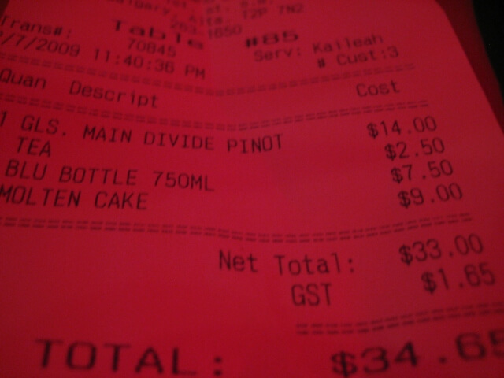

Sometimes making the right decisions to help out the environment can be easy.&nbsp; Sometimes it's tough.

A couple weeks ago, I posted a review of the Beat Niq criticizing the practice of only providing bottled water.&nbsp; Gerry Hebert, artistic director at Beat Niq responded about why their hand is forced on the issue.  I appreciate him being forth coming with explaining the concerns and challenges the Beat Niq faces in providing their entertainment while maintaining some level of profitability.&nbsp; It's easy to forget about the real challenges businesses face when we see practices that don't fit in with our ideal world.

<!-- pagebreak -->
<blockquote>Hi Derek,  Thanks for the link regarding the water concern. We have been aware of it and other customers have asked the question. The issue has been examined carefully and we have tried some different approaches over the years. I am not sure if the reviewer asked the staff about the issue but I should remind patrons that we do not have running water or drainage in the Beat Niq. Not behind the bar and nowhere on that level. It wasn't a priority in the design in 1909. Only in the bathrooms and prep room on the mid-stair level is there limited access and when we explored adding it to the club, it was a very expensive proposal given of the restraints of a 100 year old building. In order to meet city codes it would have been well over 15k to install and more to maintain. Please note that we do offer free tap water in the restaurant where it is easily available.  Secondly as a downtown venue we have high operating costs and ongoing expenses related to presenting live music in a club environment. For the most part I can assure all patrons that all revenue collected at the door from covers goes to artist fee with small deductions for tech, PA, staging issues and the doorperson. Not to mention the 50k piano. Find another club with a real piano. The only way the venue earns revenue is through appetizers and beverage sales. Unlike the restaurant which of course relies on meal service primarily. Certainly we can't sell tap water but we do need some income from patrons who take up the seating space in the venue during our limited hours of operation. In the past we had allowed bulk water to be shuttle up and down the stairs but decided against it in order to receive some revenue from each served patron and reduce traffic through the stairway.  Please let me know if this helps explain our policy.  Regards, Gerry Hebert</blockquote>

Unfortunately money is the issue, as it is for most of us.&nbsp; Often many of the best practices for the environment are some of the most expensive.&nbsp; All you can do is help encourage and support those to improve their ways.

<blockquote>Hi Gerry, thanks for your response, it's much appreciated.  I understand that the reason for bottled water comes down to the economics of running the business, but I highly encourage you to look at other ways of making up that revenue, as money is commonly used as the justification for poor enviromental practices the world over.  I know it sounds like providing bottled water doesn't sound like a big deal, but being part of this wide spread practice unnecessarily contributes to many serious problems facing our world, such as climate change, dependency on oil, over consumption, the water trade and water disparity.  While it looks like one night club's bottled water policy in itself won't change the world, responsible decision making like this by all of us is the only way to turn the tide.  I'll do my best to promote the Beat Niq (as I'm always recommending it to friends, and will continue to do so), and I would love it if you do your best to plan to reverse the bottled water policy in the future.    Thanks for your time and understanding, Derek</blockquote>
<blockquote> With the markup on bottled water, selling it is definitely a tempting proposition to make ends meet. However, there is also the unnecessary environmental cost with each bottle in its production and transportation, those are costs too.&nbsp; Also, Wine, Tea &amp; Water? What kind of crazy combination is that? </blockquote>

&nbsp;

<h3>Finding the balance</h3>

<h3>See also:</h3>
<a href="beat_niq.html">Beat Niq</a> 
