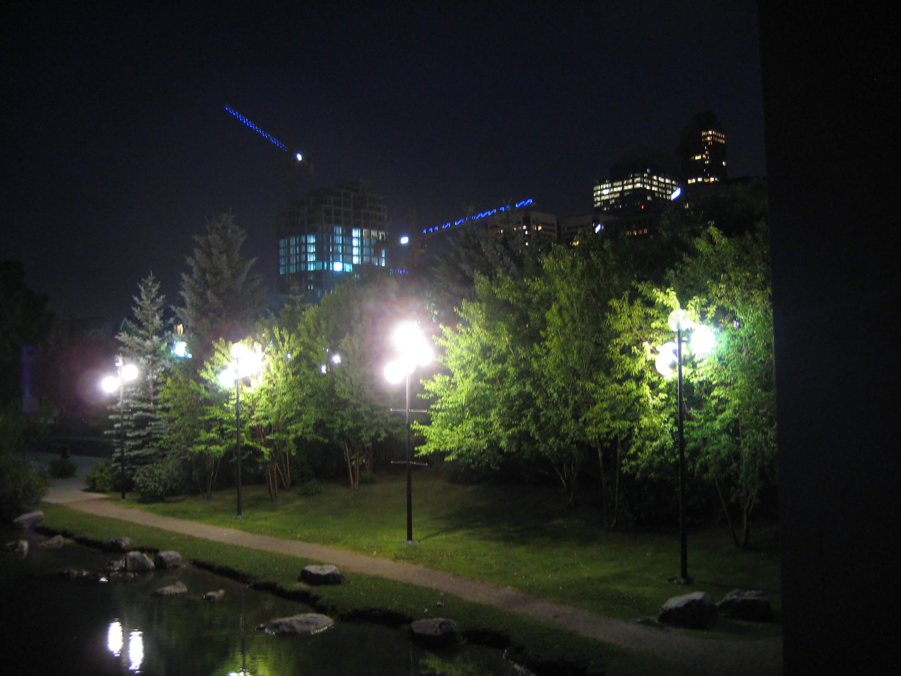

So, I have set out to write the best post I have ever written.&nbsp; No pressure or anything. Why?&nbsp; Well, it's been an absolutely ridiculous amount of time since my last article here at CalgaryUrbanite, and although we have some other great contributors on the site, things have to been too slow around these parts for my liking.&nbsp; So I need a stylish comeback.&nbsp; Something with gusto.&nbsp; Something with pizzaz.&nbsp; Something with a lot of other pseudo-adjectives.&nbsp; How am I going to do this? Well, I've compiled a list of everything I'd like to see from a comeback post.

Ironic title?&nbsp; Check. Tackling an issue that Calgarians seem opinionated about?&nbsp; Check. Being able to include a photograph I've randomly taken on my travels?&nbsp; Check. Having a completely irreverent opening paragraph?&nbsp; Check. Seriously, the most irreverent paragraph ever, probably enough to turn most people off reading this article?&nbsp; Check. Using the word <em>irreverent</em>?&nbsp; Check.  Shall we get down to business?
<!-- pagebreak -->
<blockquote> The proposed Peace Bridge, a pedestrian bridge spanning the Bow River just west of Prince's Island Park.</blockquote>

The Peace Bridge will be a 24 million dollar pedestrian bridge. And not since the Memorial Drive Pedestrian Plan has Calgary city council created such an uproar with one of their initiatives.&nbsp; Funny enough, the Peace Bridge will start right near Memorial Drive where the <a href="http://www.bowriverflow.ca/">Bow River Flow</a> will take place.&nbsp; Who knew this area of Calgary would become so controversial.

At 24 million dollars, the bridge isn't cheap.&nbsp; Though apparently competitively priced relative to other pedestrian bridges per metre, people hate their tax dollars being used on anything being construed as remotely frivolous. But lets put things in perspective: the Calgary ring road project is estimated to come in at least a total budget of 1.6 billion dollars.&nbsp; The ring road is definitely not frivolous - it's a necessity due to decades of lack luster urban planning - but it's boring, it adds nothing to our city's culture.&nbsp; Massive and boring infrastructure projects should always (and usually do) allocate a small percentage of their budget towards architecture, art, public spaces to compensate the boring and contribute to the awesome.&nbsp; At 1.5% of the ring road budget, the pedestrian bridge can be considered such a contribution.&nbsp; Of course, many argue that 1.5% could go to something more helpful like social housing or public transit, but let's face it: Regardless if that 1.5% gets spent on the Peace Bridge or not, money will continue to be mismanaged somewhere in the budget.&nbsp; If government didn't spend money because there was a more valuable place to allocate it, no money would ever get spent and nothing would ever get done.&nbsp; Plus I can forgive a little cash being spent on celebrating our city and adding to it's culture.&nbsp; Don't tell me you all accelerate your mortgage payments to their fullest and forego ever buying a nice furnishing for your home.

The bridge isn't just a frivolous use of money though.

<blockquote> I know it's hard to believe when you see places like Deerfoot Meadows/Crowfoot Crossing/Westhills etc. but some of Calgary is actually walking friendly, lets encourage more walking friendly developments.</blockquote>

To someone who lives out in Tuscany or Mackenzie Towne, a pedestrian bridge may seem like a complete waste of money. This reponse isn't surprising since in many of those communities not only do you need to drive to reach the nearest stores, but you need to drive just to get from one store, across the parking lots and roads, to another store.&nbsp; But there are places in Calgary where walking isn't just possible, it's encouraged. It's no coincidence the best cities in the world seem to be walking friendly. Less time in traffic, and more time out with the people enjoying the beauty of the city. The Peace Bridge might not be the best location or the best design, but it is a step forward to stimulate more investment in the community and encourage more walking friendly development in Calgary, and that can't be considered frivolous spending.

As for the design, beauty is in the eye of the beholder. However, the reaction that this bridge is too different than Calgary's current architecture and that we should stick with the status quo, is debatable.&nbsp; For too long the status quo for architecture in Calgary has been that of building rectangular boxes.&nbsp; Don't get me wrong, the rectangle is a tried and true shape and has served us well, but when it comes to personality, the box is nowhere to be found.&nbsp; Except boxes are everywhere to be found in Calgary.&nbsp; Our boom &amp; bust economy is preserved in the architecture we have: buildings with little thought built as quickly as they could during times of boom, and buildings with good designs that were scaled back to something less special in times of bust.&nbsp; Lets invest in something we can take a little more pride in.

<blockquote> This is east of where the bridge will be, but the area is similarily pretty, a modern foot bridge wouldn't be out of place here.</blockquote>

Although I am running dangerously close to repeating the conclusion made in the Memorial Drive Pedestrian plan post, the point is worth repeating so I'm not really all that concerned: At a passing glance the footbridge might seem like a misplaced idea, and many scoff at the idea of footbridges entirely. But to encourage the development of a vibrant and sustainable Calgary that we can be proud of, forward thinking is definitely required.&nbsp; I think we can all agree the city, and world, could use more of that.

<h3>See also:</h3>
<a href="the_memorial_drive_pedestrian_plan.html">The Memorial Drive Pedestrian Plan</a> 

Hopefully articulating the point that the growing pains of moving forward is better than not moving forward at all? <em>Check</em>.
