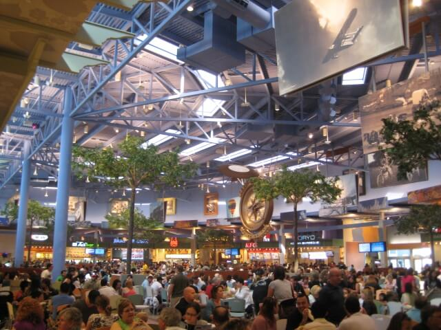
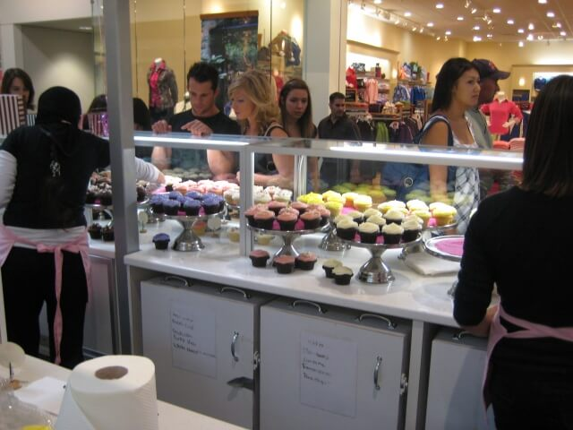
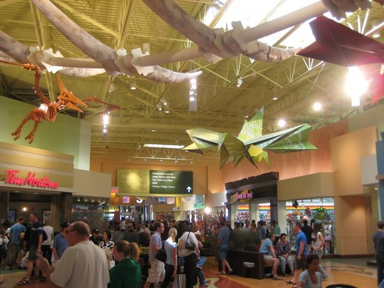

Alberta hasn't had a new shopping mall built in twenty years.&nbsp; This isn't because Albertans hate shopping malls, quite the contrary, our malls are some of the most popular locations in the province.&nbsp; The lack of new shopping malls in Alberta boils down to (like so many other things) making money.&nbsp; Shopping malls are expensive to build and strip mall retail centers are considerably cheaper.&nbsp; Sure, they lack roofs and you have to drive from one end to another just to get to all the stores, but the people will still come, enclosed mall or not.&nbsp; Why?&nbsp; Because with developers building poorly designed suburbs in search of a better bottom line and people looking to live in a house a little bigger than their means buying into them, these strip malls are often the only shopping available that is anywhere near.&nbsp; Everyone wins, well, except your gas tank, and the environment.&nbsp; But you get a quiet neighbourhood and the developers maximize their profits.  When I found out CrossIron Mills was defying the trend and being built as an enclosed shopping mall, I got excited.
<!-- pagebreak -->
<blockquote> Clearly I wasn't the only one to get excited.</blockquote>

Choosing to build a real shopping mall over a strip mall is a smart and responsible decision, one which no one else has been able to make in the last two decades.&nbsp; But with high gas prices, recession, debt, low consumer confidence, how could anyone afford the risk of the additional cost required to build an actual shopping mall?&nbsp; I quickly found out.&nbsp; CrossIron Mills is located just outside of Balzac, where space is large and land is cheap. Instead of building up, they built out, far out - the mall is about 25 kilometres away from the Calgary city centre, and it's 1.4 million square feet of retail space take up the largest geographic footprint possible because it's all built on one floor.&nbsp; CrossIron Mills is anything but a smart and responsible decision in retail development.

<blockquote> Okay, well this actually is a smart decision - placing a buttercream cupcake kiosk right outside the women's fashion section.&nbsp; Respect.</blockquote>

I often get asked why I care so much about the environment. I've been told by many that we have such great outdoor spaces, beautiful forests and pristine water sources here in Canada that the environment really feels like an overblown concern. It's pretty simple why I care about the environment, it's because I'm not living in a dreamworld. I'm not living in a fairy tale where we can burn off what we dig up while growing out of control and expect it to keep going. That's not possible. CrossIron Mills is such a fairy tale.&nbsp; Building a mall so far and so wide has real costs.&nbsp; A round trip from the city centre to Chinook Centre is 10 km.&nbsp; A round trip from the city centre to CrossIron Mills is 50km.&nbsp; (Editor's Note: Most people don't live in the city centre, but the mean position of a Calgarian must be somewhere near it, likely to the south of it meaning people are even farther from CrossIron Mills on average than this estimate will use).&nbsp; Approximately 250,000 people attended the mall on it's opening weekend.&nbsp; Let's say 100,000 cars made the trip.&nbsp; That's 4 million extra kilometres driven because of CrossIron Mills' location.&nbsp; That's enough distance to go to the Moon and back over 5 times. 4 million extra kilometres over one weekend, at one mall.&nbsp; That's real.&nbsp; Multiply that irresponsibility the world over, and that's devastating.

<blockquote> The fossil neighbourhood.  A good metaphor for the eventual fate of malls like these - or us.</blockquote>

Now, I shop and I like to shop, but I have also made great strides in becoming aware of my impact and I am making smarter decisions because of it.&nbsp; That's what we should encourage everyone to do.&nbsp; We aren't perfect, but we can head in that direction. Our society isn't going to stop shopping any time soon, and that's fine, but in this day and age this kind of reckless irresponsibility can't be tolerated.

It was a gutsy move to build a mall that defies the economy and defies the fact our society is finally waking up to the unsustainable pace at which we consume.&nbsp; The mall will most likely be a huge success in the short term, but as the demands we place on our world reach their breaking point, CrossIron Mills' ultimate legacy is to serve as a last reminder of our collective irresponsibility here in Calgary.&nbsp; It's either that, or we really are living in a fairy tale.
