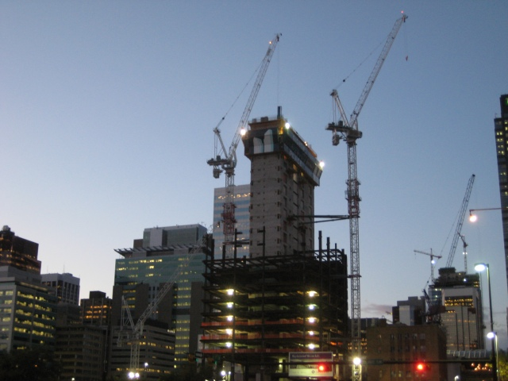
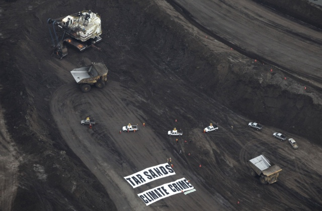

Hey, so guess what I did today? I dug up some <a href="http://en.wikipedia.org/wiki/Bitumen">bitumen</a> in the Fort McMurray Oil Sands. I've done it a bunch of times actually.&nbsp; I had surgery to remove a wisdom tooth yesterday morning and I still did it!&nbsp; You know, now that I think about it, I haven't even been north of Edmonton yet I've still managed to do it! You've done it too. I don't even know you, but I know you've done it. Greenpeace went up to Fort Mac to protest Oil Sands development, and you know what? They've dug up bitumen too.
<!-- pagebreak -->
<blockquote> I try to keep this site Calgary focused, but I feel justified in turning out thoughts north, since the Oil Sands is reason for a lot of us to be here, and the reason Calgary is the city we know.</blockquote>

Now, I've never actually touched bitumen, instead I constantly order people to dig up the stuff for me. Not directly of course, as fun of an ego trip as that might be - I give my orders to dig up bitumen while I'm at the gas station, or the grocery store. So do you. And so does Greenpeace. The bottom line is that we all create the demand for oil with what we buy. We can't spend money on consuming oil and then tell business to stop supplying it to us. <a href="http://www.cbc.ca/canada/edmonton/story/2009/09/15/edmonton-greenpeace-oilsands-protest.html">Greenpeace took action to declare that the Oil Sands are a 'climate crime'</a>, but failed point out that all of us, including Greenpeace, drive the Oil Sands business. If we understand and appreciate this relationship we have to the Oil Sands, we can start shifting demand away from it. Green power. Buy local. Reduce. Reuse. Recycle. Public Transportation. Carpooling. Turns out all those buzz words actually mean something.&nbsp; All these actions will create a momentum, a global economic shift, that curbs demand for oil, lowers prices, and prices dirty oil out of the market.

Of course, even with taking responsible action, there still aren't many opportunities to escape our oil economy, so we need to demand strong leadership on the issue.&nbsp; Perhaps that was the message Greenpeace was trying to share.&nbsp; But if it was, not many will listen.&nbsp; Stopping down the oil sands tomorrow would destroy the livelyhood of hundreds of thousands of families and that's not an idea that the masses will ever entertain, and why should they?&nbsp; Shutting down the oil sands isn't strong leadership, it's thoughtless.&nbsp; Strong leadership is that which places incentives for greener industry so we can transition to a more environmentally friendly future as quickly as possible, without destroying lives.&nbsp; Hard to believe it could happen? Well, in some parts of the world<a href="http://features.csmonitor.com/environment/2008/08/20/germany’s-key-to-green-energy/"> it is happening right now</a>, although not so much here in Alberta.&nbsp; We need to demand it.&nbsp; And this issue, like all environmental issues, isn't partisan. People constantly talk about moving farther to the left, or farther to the right, but we need to finally talk about moving forward.

<blockquote> Hey, that's cool you're telling them to stop the Oil Sands, but what fuel did you use to get out here?</blockquote>

I'm all for making a statement (with non-violence of course!), and Greenpeace turning our attention to the environmental stain, if not disaster that is the Athabasca Oil Sands is noble.&nbsp; I don't want to make the argument that because they aren't perfect environmental stewards, Greenpeace can't take stands on the environment.&nbsp; On the contrary, no one is perfect, and letting our imperfections stop us from doing good things is probably the worst argument I've ever heard (and, again, even though I don't know you, I'm willing to bet you've seen someone try to use that argument on the comments section of a news site). I'm making the argument that asking for the Oil Sands to shut down, without understanding that we are responsible for it being in service to begin with, is misleading and only serves to alienate people against the cause of a cleaner Alberta.

Oil Sands development won't stop by telling everyone it should stop.&nbsp; Oil Sands development will stop when everyone realizes their own demand they place on developing the oil sands every single day, and starts taking action about it.
