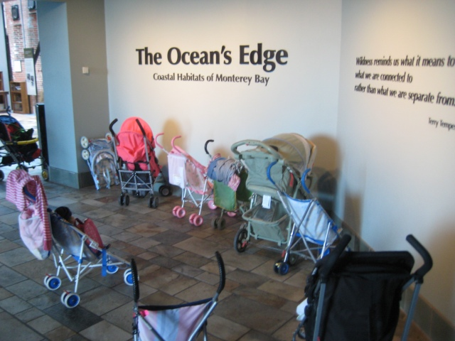
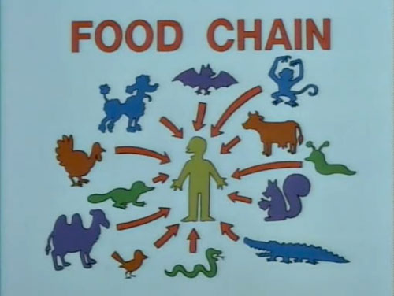
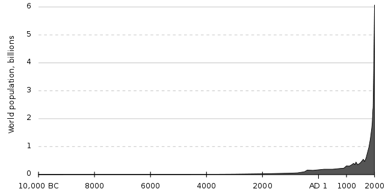

So, another week at CalgaryUrbanite, another revelation I have to share with everyone. Last week I mentioned how we are all driving the Oil Sands business whether we like developing them or not.&nbsp; Well this week I drop an even bigger bombshell (We are entering the Fall sweeps season after all).&nbsp; Forget the <a href="http://www.canada.com/technology/gaming/Police+allege+Ponzi+type+scheme+thwarted+thousands+Calgary/2014608/story.html">latest Ponzi-Scheme bust in Calgary</a>, we are part of the biggest Ponzi scheme of all time.

The Ponzi scheme according to Wikipedia (so yes, there might be a few swear words vandalized into the definition) is:

<blockquote>A fraudulent investment operation that pays returns to separate investors from their own money or money paid by subsequent investors, rather than from any actual profit earned.</blockquote>

So basically the first "investors" get massive returns on their "investment" by being given the money from the newest investors who are convinced that the whole thing is for real.&nbsp; When the whole system implodes, the newer investors never get their investments back, and people's lives are destroyed.&nbsp; We like to think we're smart enough that we will never be duped into such a scam, but the scary thing is, you and I just invested in one.
<!-- pagebreak -->

I stumbled on to this article today, <a href="http://www.cbc.ca/canada/story/2009/09/22/canada-births-2007-statistics-boom.html">Women over 30 help birthrate rise in 2007</a>, but it was the reactions from readers I found interesting.&nbsp; Reactions were completely polarized of course, but the CBC could write about lollipops and people would be screaming bloody murder about the Charter of Rights and Freedoms.&nbsp; What interested me was that I found myself agreeing with points from the full range of opinion.&nbsp; I was agreeing with those who argued that our birth rate being below the rate of replacement was a good thing, because we could help bring the world's population down and place less of a strain on the world's resources.&nbsp; I was also understanding why those claiming that our increase in birth rate was a good thing, because it helps our economy and helps pay for the health care and pensions of our aging population.&nbsp; The only people I couldn't agree with were the bigots wanting more Canadians to procreate in an effort to keep immigrants out.&nbsp; Yikes.

<blockquote> After visiting the Monterey Bay aquarium on a Labour Day long weekend, my ears and I are convinced having a lower birth rate, much <em>much </em>lower, would be a good thing.</blockquote>

But I got thinking, the only real reason people were in favour of a growing population was because it was necessary to sustain our economy (even if that way of thinking is at complete odds with sustaining our environment). Think about that for a second.&nbsp; We have to continue to grow our population to keep our economy sustained.&nbsp; I thought about it for a second, and a chain of thoughts progressed:&nbsp; There's no way we can keep growing our population (especially since our environment is on the verge of tapping out of the ring as it is).&nbsp; If this is how our economy sustains itself, it's fake and hollow.&nbsp; I've been duped into a Ponzi scheme.&nbsp; We all have.

<blockquote> If our population keeps growing, and we keep consuming anything and everything, something has to give. Just ask any Scientician.</blockquote>

Our economy is a text-book definition of a Ponzi scheme.&nbsp; Like a Ponzi scheme, little profit in our economy is being made through actual investment.&nbsp; Rather, the bulk of the profit we get through our economy is through consumption, leaving us with nothing.&nbsp; And just like a Ponzi scheme, it will grow until it can't sustain itself and there is no where to look to bring in new money to pay off everyone.&nbsp; Most of our economy runs off of digging up non-renewable resources and consuming them.&nbsp; More alarmingly, with the pace our world population continues to grow at, we have effectively made even our renewable resources a form of non-renewable consumption.&nbsp; We pollute our water and atmosphere at rates higher than the Earth's natural systems can clean them.&nbsp; We cut down trees faster than forests can replenish, and we can't continue to supply fertilizers and irrigation at a rate high enough to sustain our agriculture.&nbsp; Not only are we in the world's largest Ponzi scheme, we are in one on the verge of collapsing.

<blockquote> I wonder if there is a correlation between people who believe this can continue and people who believe in Santa Claus.</blockquote>

Forget about global warming, extinction and all that green enviro jazz, and just think about the economy, or your own wallet if that helps.&nbsp; If we want to build a real economy and not a house of cards that's on the cusp of collapse, it needs to be built on the idea of generating wealth off of something sustainable, that doesn't rely on impossible idea of infinite growth that we have been tricked into.&nbsp; So without even considering the environment, we've actually also fell into the solution for saving it - not exploiting it to collapse.&nbsp; It's ironic that while people continue to argue in favour of the environment over the economy, or the economy over the environment, both problems actually have the exact same solution.

So, should we try to get out of this Ponzi scheme, or should we forget all that noise and just debate the merits of making babies as fast as possible to keep immigrants out?&nbsp; Please don't fail me world!
